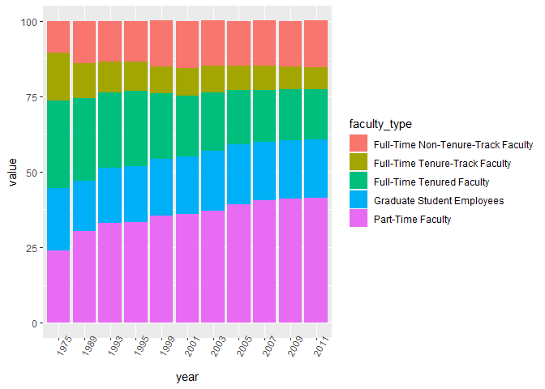
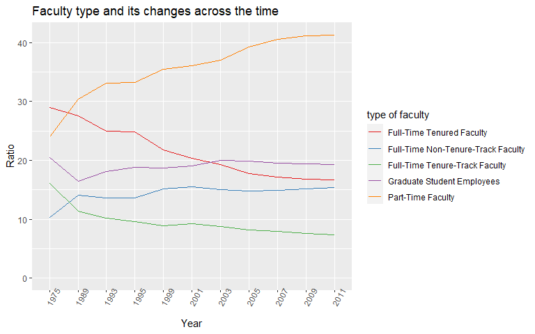
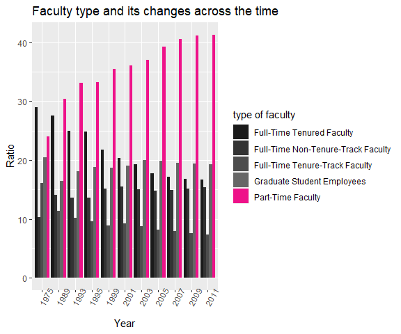
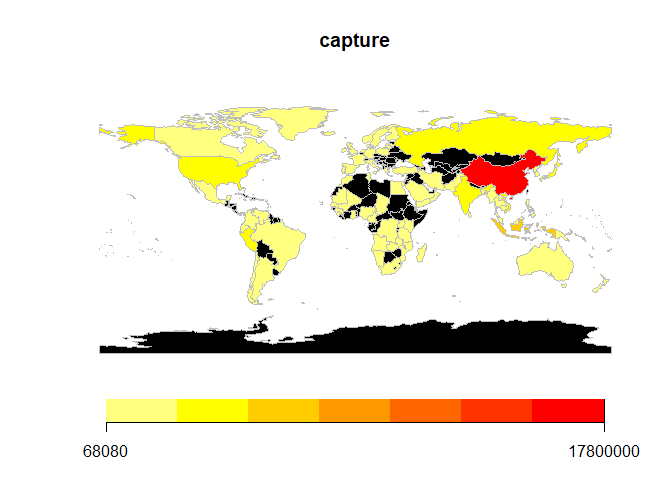
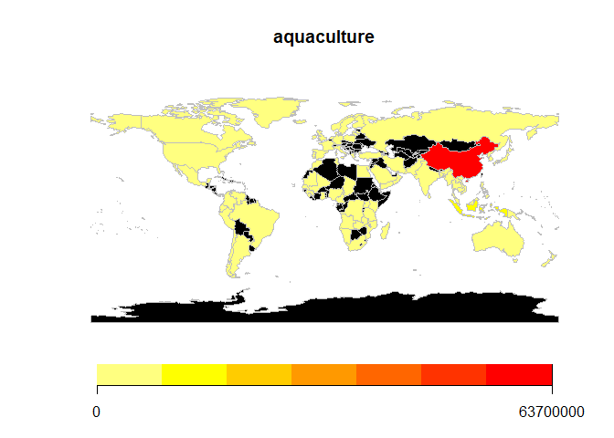
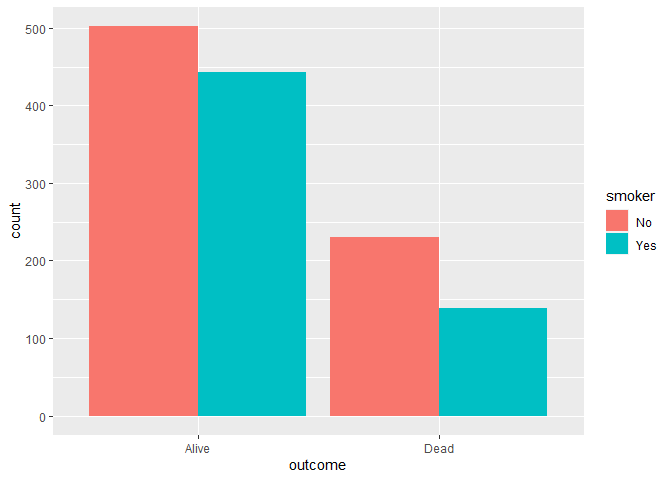
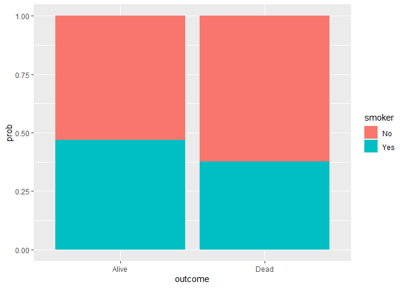
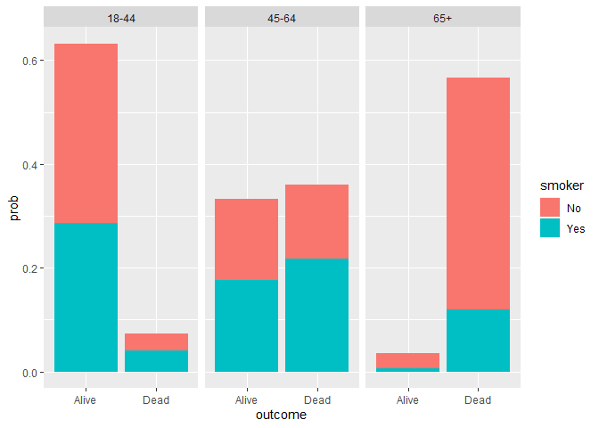

Lab 06 - Sad plots
================
Insert your name here
Insert date here

### Load packages and data

``` r
library(tidyverse) 
library(dsbox) 
```

### Prepare for Exercise

``` r
staff <- read_csv("data/instructional-staff.csv")
```

    ## Rows: 5 Columns: 12

    ## -- Column specification --------------------------------------------------------
    ## Delimiter: ","
    ## chr  (1): faculty_type
    ## dbl (11): 1975, 1989, 1993, 1995, 1999, 2001, 2003, 2005, 2007, 2009, 2011

    ## 
    ## i Use `spec()` to retrieve the full column specification for this data.
    ## i Specify the column types or set `show_col_types = FALSE` to quiet this message.

``` r
print(staff)
```

    ## # A tibble: 5 x 12
    ##   faculty_type    `1975` `1989` `1993` `1995` `1999` `2001` `2003` `2005` `2007`
    ##   <chr>            <dbl>  <dbl>  <dbl>  <dbl>  <dbl>  <dbl>  <dbl>  <dbl>  <dbl>
    ## 1 Full-Time Tenu~   29     27.6   25     24.8   21.8   20.3   19.3   17.8   17.2
    ## 2 Full-Time Tenu~   16.1   11.4   10.2    9.6    8.9    9.2    8.8    8.2    8  
    ## 3 Full-Time Non-~   10.3   14.1   13.6   13.6   15.2   15.5   15     14.8   14.9
    ## 4 Part-Time Facu~   24     30.4   33.1   33.2   35.5   36     37     39.3   40.5
    ## 5 Graduate Stude~   20.5   16.5   18.1   18.8   18.7   19     20     19.9   19.5
    ## # ... with 2 more variables: `2009` <dbl>, `2011` <dbl>

Data reshaping

``` r
staff_long <- staff %>%
  pivot_longer(cols = -faculty_type, names_to = "year") %>%
  mutate(value = as.numeric(value)) %>%
  print()
```

    ## # A tibble: 55 x 3
    ##    faculty_type              year  value
    ##    <chr>                     <chr> <dbl>
    ##  1 Full-Time Tenured Faculty 1975   29  
    ##  2 Full-Time Tenured Faculty 1989   27.6
    ##  3 Full-Time Tenured Faculty 1993   25  
    ##  4 Full-Time Tenured Faculty 1995   24.8
    ##  5 Full-Time Tenured Faculty 1999   21.8
    ##  6 Full-Time Tenured Faculty 2001   20.3
    ##  7 Full-Time Tenured Faculty 2003   19.3
    ##  8 Full-Time Tenured Faculty 2005   17.8
    ##  9 Full-Time Tenured Faculty 2007   17.2
    ## 10 Full-Time Tenured Faculty 2009   16.8
    ## # ... with 45 more rows

``` r
staff_long %>%
 
  ggplot(aes(x = year, y = value, fill = faculty_type)) +
  theme(axis.text.x=element_text(angle=60)) +
  geom_col(position="stack")
```

<!-- --> ### Exercise
1

``` r
staff_long$faculty_type<-as.factor(staff_long$faculty_type)
staff_long$faculty_type <- relevel(staff_long$faculty_type,"Full-Time Tenured Faculty","Full-Time Tenure-Track Faculty", "Full-Time Non-Tenure-Track Faculty", "Part-Time Faculty","Graduate Student Employees")
```

``` r
staff_long %>%
  ggplot(aes(x = year, y = value, group = faculty_type, color = faculty_type)) +
  geom_line() +
  ylim(0, max(staff_long$value)) +
  labs (title="Faculty type and its changes across the time",
        x= "Year", y="Ratio", color="type of faculty")+
  theme(axis.text.x=element_text(angle=60))+
  scale_colour_brewer(palette="Set1")
```

<!-- -->

### Exercise 2

``` r
staff_long %>%
  ggplot(aes(x = year, y = value, fill = faculty_type)) +
  geom_col(position="dodge")+
  theme(axis.text.x=element_text(angle=60))+
  scale_fill_manual(
    values = c("Full-Time Tenured Faculty" = "gray10", "Full-Time Non-Tenure-Track Faculty" = "gray20", "Full-Time Tenure-Track Faculty"="gray30","Graduate Student Employees"="gray40", "Part-Time Faculty"="deeppink2")) +
  labs (title="Faculty type and its changes across the time",
        x= "Year", y="Ratio", fill="type of faculty")
```

<!-- --> ### Exercise
3

``` r
fisheries <- read_csv("data/fisheries.csv")
```

    ## Rows: 216 Columns: 4

    ## -- Column specification --------------------------------------------------------
    ## Delimiter: ","
    ## chr (1): country
    ## dbl (3): capture, aquaculture, total

    ## 
    ## i Use `spec()` to retrieve the full column specification for this data.
    ## i Specify the column types or set `show_col_types = FALSE` to quiet this message.

``` r
fisheries <- fisheries %>%
  dplyr::filter(total>100000)
```

``` r
library(maps)
```

    ## 
    ## Attaching package: 'maps'

    ## The following object is masked from 'package:purrr':
    ## 
    ##     map

``` r
library(mapdata)

library(rworldmap)
```

    ## Loading required package: sp

    ## ### Welcome to rworldmap ###

    ## For a short introduction type :   vignette('rworldmap')

``` r
fish_cap<- joinCountryData2Map(fisheries, joinCode="NAME", nameJoinColumn="country")
```

    ## 82 codes from your data successfully matched countries in the map
    ## 0 codes from your data failed to match with a country code in the map
    ## 161 codes from the map weren't represented in your data

``` r
cap1<-mapCountryData(fish_cap, nameColumnToPlot="capture", catMethod="fixedWidth", addLegend = TRUE, missingCountryCol="black")
```

<!-- -->

``` r
cap2<-mapCountryData(fish_cap, nameColumnToPlot="aquaculture", catMethod="fixedWidth",addLegend = TRUE, missingCountryCol="black")
```

<!-- -->

``` r
# tried messy graph but better to erase it  

# fisheries_lon <- fisheries %>%
#   pivot_longer(cols=-c("country","total"), names_to="type")%>%
#   mutate(value=as.numeric(value))%>%
#   print(head(100))
# 
```

## Stretch Practice with Smokers in Whickham

``` r
#install.packages('mosaicData')
library(tidyverse) 
library(mosaicData) 
```

``` r
data(Whickham)
Whickham<-Whickham
#?Whickham
```

1.  observation. because we cannot make people smoke for a life, and we
    cannot manipulate their smoke habit, age, death status.
2.  1314, # of participants.
3.  3
4.  I think smokers would die early :(

``` r
Whickham %>%
  count(smoker, outcome)
```

    ##   smoker outcome   n
    ## 1     No   Alive 502
    ## 2     No    Dead 230
    ## 3    Yes   Alive 443
    ## 4    Yes    Dead 139

5.  I think it does not make a cogent case to draw the conclusion on
    smoking-health relationship from the above table, because I think
    Age is really important variable for death status (it is not health
    status I think).

``` r
Whickham%>%
  ggplot(aes(x=outcome, fill=smoker)) +
  geom_bar( position="dodge")
```

<!-- -->

``` r
data(Whickham)
?Whickham
```

    ## starting httpd help server ... done

### Exercise 5

``` r
Whickham%>%
  ggplot(aes(x=outcome, fill=smoker)) +
  geom_bar( position="dodge")
```

<!-- -->

``` r
## This graph does not give any explanations on possibilities. 
## it only depicts the numbers. 
## So I tried ratio-manner approaches. 

 Whickham2 <-Whickham %>%
  count(smoker, outcome) %>%
  group_by(outcome) %>%
  dplyr::mutate(prob = n/sum(n))
 
 Whickham2%>%
  ggplot(aes(x=outcome, y=prob, fill=smoker)) +
  geom_bar(stat="identity")
```

<!-- --> ### Exercise
6

``` r
Whickham <-Whickham %>%
  dplyr::mutate(age_cat = case_when(
    age <= 44 ~ "18-44",
    age > 44 & age <= 64 ~ "45-64",
    age > 64 ~ "65+",
    TRUE ~ NA_character_))

Whickham3 <-Whickham %>%
  count(smoker, age_cat, outcome)%>%
  group_by(outcome) %>%
  dplyr::mutate(prob = n/sum(n))

Whickham3 %>%
  ggplot(aes(x=outcome, y=prob, fill=smoker)) +
  facet_grid(~age_cat)+
  geom_bar(stat="identity")
```

<!-- -->
